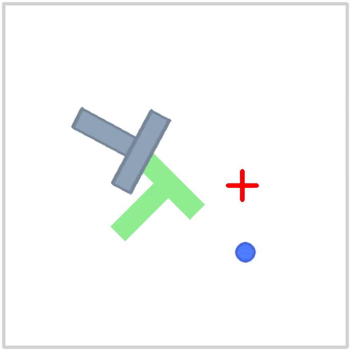

# Behavior Transformer

A PyTorch-based implementation of the Behavior Transformer model for multi-modal behavior cloning for environments with continuous observation and action spaces.
The Behavior Transformer approach was first proposed in the paper titled: [`Behavior Transformers: Cloning k modes with one stone`](https://arxiv.org/abs/2206.11251).
To the best of my information and according to the paper, the original source code and datasets were never released publicly and remain proprietary.
Therefore, this implementation was based solely on the description given in the original paper.

## Table of Contents

* [Installation Instructions](#installation-instructions)
* [Behavior Transformer Summary](#behavior-transformer-summary)
    * [Motivation and Overview](#motivation-and-overview)
    * [Action Binning, Encoding and Decoding](#action-binning-encoding-and-decoding)
    * [Loss Functions](#loss-functions)
* [Package Summary](#package-summary)
* [PushT Example](#pusht-example)
* [References](#references)

## Installation Instructions

This package can either be installed within the local Python environment or using a virtual one. Regardless of the installation method of choice, first clone this repository locally and navigate to its directory:
```bash
git clone https://github.com/Sherif-Sameh/BehaviorTransformer.git
cd /path/to/BehaviorTransformer/repository
```

### Virtual Environment using Pixi (recommended)

The recommended installation method is to install inside a Python virtual environment using the [`Pixi`](https://pixi.sh/latest/) package management tool.
Firstly, install Pixi on Linux/macOS using the following single command.
```bash
curl -fsSL https://pixi.sh/install.sh | sh
```

Then, to setup the virtual environment and install all package dependencies, simply run the following command inside the directory of the `BehaviorTransformer` repository.
```bash
pixi install
```

After installation, run the following command to start an interactive bash session inside the virtual environment.
```bash
pixi shell
```

### Local Environment using Pip
If you want to install the package inside your local Python environment or an existing virtual environment, simply run the following command inside the directory of the `BehaviorTransformer` repository.
```bash
pip install .
```

## Behavior Transformer Summary

This section provides a summary of the most defining features of the Behavior Transformer (BeT) approach. 

### Motivation and Overview
The motivation behind the BeT was to come-up with a behavior cloning (BC) approach that could simultaneously achieve the three following goals for environments with continuous observation and action spaces.

1. Accurately model multi-modal behavior in datasets rather than capturing only a single mode or an averaging of all modes.
2. Relax the Markov assumption that only the prior state is needed for action prediction.
3. Avoid the slow iterative inference process of Diffusion-based generative policies.

Therefore, a small GPT-based sequence-to-sequence model with masked causal self-attention was chosen to model the policy's behavior.
The model receives a sequence of observations $(\mathbf{o}_{t}, \mathbf{o}_{t-1}, \cdots, \mathbf{o}_{t-h+1})$ and predicts a corresponding sequence of actions $(\mathbf{a}_{t}, \mathbf{a}_{t-1}, \cdots, \mathbf{a}_{t-h+1})$.
However, to perserve the multi-modality of the GPT-based policy, continuous actions are broken down into two components: a discrete action bin (i.e. a token) + a continuous offset.
This approach facilitates learning mutli-modal behavior through the discrete bins and retains fine-grained control through the added actions residuals to the location of each action bin.

### Action Binning, Encoding and Decoding

To determine the locations of the discrete action bins in the continuous action space, a clustering approach is applied to all actions available in the dataset prior to policy training.
In the BeT approach, K-Means clustering is used for this purpose with the number of clusters being a used-define hyperparameter.
After clustering is done, the cluster center locations $\mathbf{c}_{0, 1, \cdots, k-1}$ are stored for use in the action encoding and decoding processes.

The encoding process takes a continuous action $\mathbf{a}_{t}$ and factors it into a discrete bin $\left[\mathbf{a}_{t} \right] = \argmin_i d\left(\mathbf{a}_{t},  \mathbf{c}_i \right)$, where $d(\cdot, \cdot)$ is a distance function, and a continuous offset $\left \langle \mathbf{a}_{t} \right \rangle = \mathbf{a}_{t} - \mathbf{c}_{\left[\mathbf{a}_{t} \right]}$.
The decoding process follows the opposite pattern.
Given a discrete bin $\left[\mathbf{a}_{t} \right]$ and its corresponding offset $\left \langle \mathbf{a}_{t} \right \rangle$, the full actions $\mathbf{a}_{t} = \mathbf{c}_{\left[\mathbf{a}_{t} \right]} + \left \langle \mathbf{a}_{t} \right \rangle$ is returned.


### Loss Functions

The BeT model is trained using a combination of two loss functions.
The first is a Focal Loss $\mathcal{L}_{focal}$ used to learn the discrete action bins.
The focal loss is a modification to the Cross-Entropy Loss such that $\mathcal{L}_{focal} = -(1 - p_{t})^\gamma \log(p_{t})$, where $p_{t}$ is the predicted probability of the ground truth class. The second term in the combined loss function, named as the multi-task loss $\mathcal{L}_{multi-task}$, handles the fitting of the continuous offsets of the model.
The multi-task loss is simply a MSE loss between the true action offset and the predicted offset corresponding to the true action bin.

These two losses $\mathcal{L}_{focal}$ and $\mathcal{L}_{multi-task}$ are combined together as $\mathcal{L}$ = $\mathcal{L}_{focal} + \alpha \mathcal{L}_{multi-task}$, where $\alpha$ is a scalar constant determined during the very first policy update to make the two losses of equal magnitude.


## Package Summary

This section provides a summary of the main modules and sub-modules in this Python package.

* [`clusterers`](btransformer/clusterers): The clusterers module defines a standard interface for what a clustering module should provide and contains an implementation of such a module using K-Means clustering.

* [`modules`](btransformer/modules): The 'modules' module contains PyTorch modules that act as building blocks for the higher-level models. These are modules that would typically never be used separately as their own models.

* [`models`](btransformer/models): The models module defines a standard interface for trainable models, contains GPT-based policy implementation with the two output heads for discrete bins and continuous offsets and [`btransformer`](btransformer/models/btransformer.py) sub-module that groups all the pieces needed for defining a BeT model for either pure proprioceptive observations or mixed image + proprioceptive observations.

* [`metrics`](btransformer/metrics): The metrics module defines a standard interface for metrics, which is heavily based-on Flax NNX's `Metric` class. It provides two metric implementations of a standard accumulator-like metric for recording values from single tensors like loss values and another for measuring absolute errors between two tensors. Similiar to the Torchvision transforms approach, multiple metrics can be composed together through the [`ComposeMetric`](btransformer/metrics/compose.py#L10) class.

* [`loggers`](btransformer/loggers): The loggers module defines a standard interface for loggers to be used during training and in conjuction with the metrics module. It provide two implementation of a console-based and a CSV-based logger respectively. Similar to metrics, multiple loggers can be composed together through the [`ComposeLogger`](btransformer/loggers/compose.py#L9) class.

* [`trainers`](btransformer/trainers): The trainers module defines a standard interface that a trainer of a standard trainable model in the package must follow. A trainer handles all the standard PyTorch training boiler-plate training code, updating metrics and logging their values as well as running evaluations and saving the best reached model during training. The module provides an implementation of a trainer for the BeT model.

* [`utils`](btransformer/utils): The utils module provides several helpful functions that are needed sporadically throughout the package.


## PushT Example

<p align="center">
  
</p>

An example of training and deploying a BeT model is provided using the [`PushT`](https://github.com/huggingface/gym-pusht) Gymnasium environment.
The dataset used for training is retrieved from the [`LeRobot`](https://huggingface.co/lerobot) project on Hugging Face at this [`link`](https://huggingface.co/datasets/lerobot/pusht).

To run the provided example, first we need to install additional dependencies.
If you're using Pixi, then just run the following commands inside the directory of the `BehaviorTransformer` repository.

```bash
pixi install -e pusht
pixi shell -e pusht
```

Afterwards, we first run the script responsible for initializing the K-Means clustering module and storing the location of the cluster centers.
Then, we start the training process of the BeT model which will make use of a wrapped version of the PushT dataset that handles sequence sampling, observation normalization and action rescaling.
The BeT training script tracks both the combined and separate loss values as well as the absolute error between the true and predicted actions and logs them to both the console and a CSV file.
You can run these two scripts as follows.

```bash
python examples/pusht/train_kmeans.py
python examples/pusht/train_bt.py
```

Lastly, to visualize the trained policy, we can run it inside the actual Gymnasium-based environment.
By running the following script, the policy is loaded and ran in the environment for four episodes which are recorded and stored in a single video file inside the same [`pusht`](examples/pusht) examples directory.

**Important Note**

Currently although the BeT seems to fit perfectly to the available dataset, its performance inside the Gymnasium environment does not reflect that. 
This could be down to multiple reasons but the two most likely culprits in my opinion are the pre-trained image encoder and model/training hyperparameters used. 

For the image encoder, we use the pre-trained weights for the ResNet-18 models of ImageNet from Torchvision. 
The PushT environment looks nothing like ImageNet and these deep CNN models have been shown in the past to not work as expected in RL environments. 
A much better approach should be pre-training a smaller CNN model using any self-supervised training approach on the PushT environment and using that instead.

Meanwhile, the configuration in the [`config.toml`](examples/pusht/config/config.toml) is loosely based on the hyperparameters used in the original BeT paper.
However, since this is a different benchmark to any of the used ones, these hyperparameters are most likely very sub-optimal and should be tuned using any hyperparameter optimization approach. 


## References

* The original paper where BeT was first proposed [`Behavior Transformers: Cloning k modes with one stone`](https://arxiv.org/abs/2206.11251).

* Andrej Karpathy's [`minGPT`](https://github.com/karpathy/minGPT/tree/master) repository which the GPT model implementation was heavily based on.

* The LeRobot PushT [`dataset`](https://huggingface.co/datasets/lerobot/pusht).

* The PushT Gymnasium-based [`environment`](https://github.com/huggingface/gym-pusht).